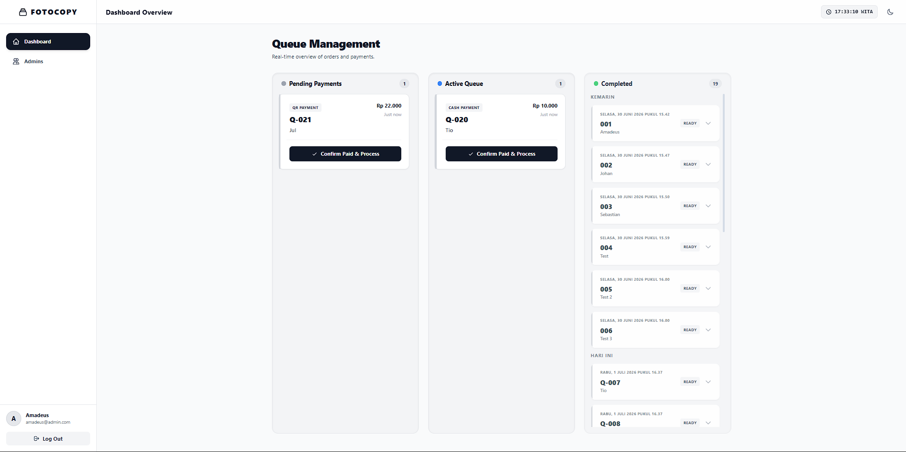
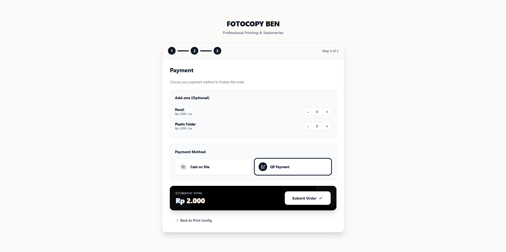
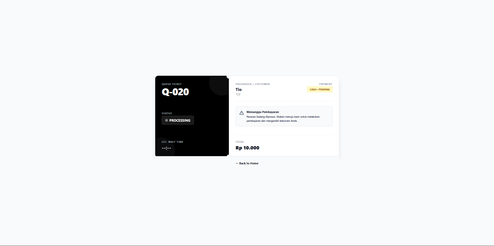
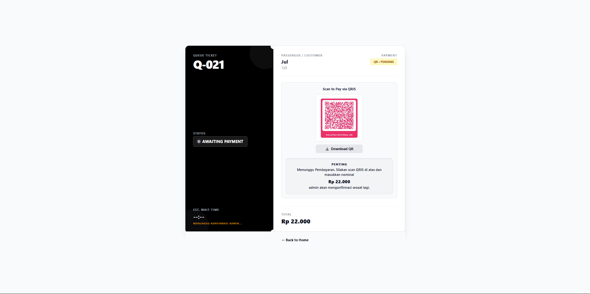

# 📸 Fotocopy Ben - Quick Service

<p align="center">
  A modern, efficient, and user-friendly web-based queue management system designed for <b>Fotocopy Ben</b>. This project streamlines the printing and stationery service workflow, bridging the gap between customers and store staff with real-time updates and secure payment handling.
</p>

---

## ✨ Key Features

*   **⚡ Real-time Queue Management**: Admins can oversee pending, active, and completed orders instantly via a dynamic Kanban-style dashboard.
*   **💳 Dual-Payment Workflow**: Supports flexible payment methods:
    *   **Cash**: Pay-on-counter process for local convenience.
    *   **QRIS**: Seamless digital payment flow with admin confirmation.
*   **⏳ Dynamic Wait Times**: Automated countdown timers synced with the admin's processing status, including "delayed" notifications for high-volume periods.
*   **📱 Mobile-First Design**: Optimized for mobile devices, allowing customers to track their queue status easily from their phones.
*   **🔐 Admin Security**: Role-based access control with a professional, minimalist interface.
*   **🧹 Auto-Cleanup**: Smart database management that automatically clears completed orders after 48 hours to maintain high performance.

---

## 🖼️ Project Preview

| Admin Dashboard | User Ticket Interface |
| :---: | :---: |
|  |  |

| Cash Payment Flow | QRIS Payment Flow |
| :---: | :---: |
|  |  |

---

## 🛠️ Tech Stack

*   **Backend**: Native PHP (MySQLi)
*   **Frontend**: Tailwind CSS (via CDN), Alpine.js
*   **Database**: MySQL (phpMyAdmin)
*   **Server**: Local XAMPP Environment

---

## 🚀 Getting Started

1. **Clone the repository** to your local `htdocs` folder:
   ```bash
   git clone [https://github.com/yourusername/Fotocopy_Ben.git](https://github.com/yourusername/Fotocopy_Ben.git)
